# Problem Set 0: Images as Functions

###1. Edge image
a0) Input image - a1) Edge image  
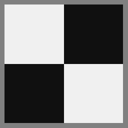
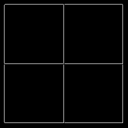

###2. Hough Transform for Lines
a) Hough space - b) Highlighted Peaks - c) Highlighted lines  
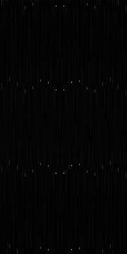
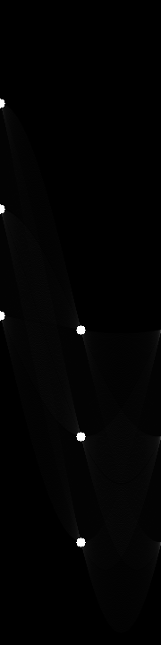
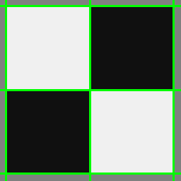

###3. Hough Transform for Lines on Noisy Image
a0) Noisy input Image - a1) Filtered image - b1) Edge image of noisy image - b2) Edge image of filtered image  
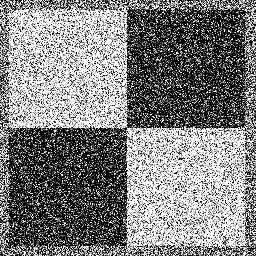
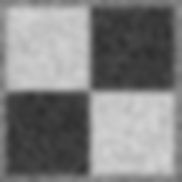
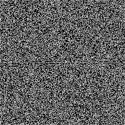
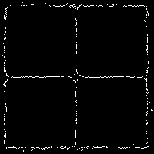  
c1) Hough space of edge image - c2) Noisy input image with highlighted lines  
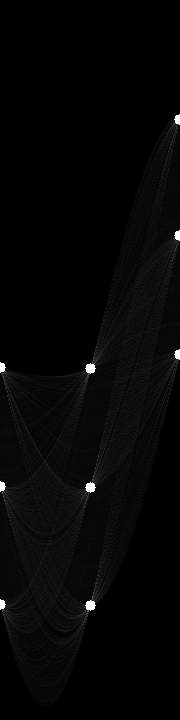
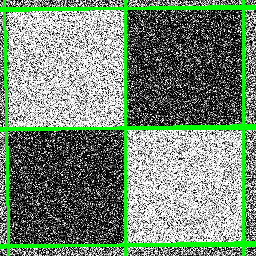

###4. Hough Transform for Lines on a more Complex Image
a0) Input image - a1) Filtered input image - b1) Edge image  
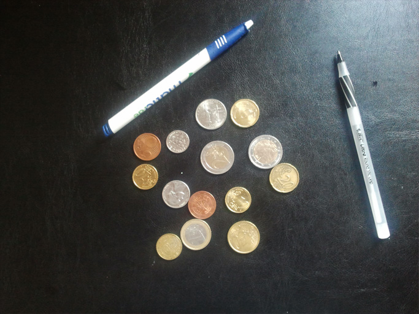
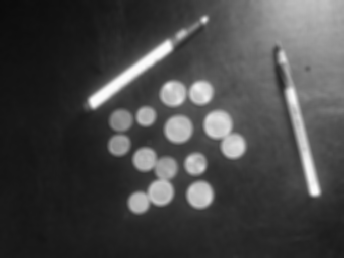
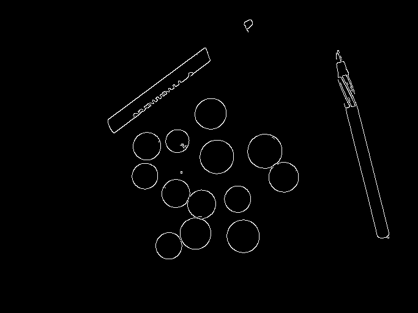  
c1) Hough space - c2) Original input image with highlighted lines  
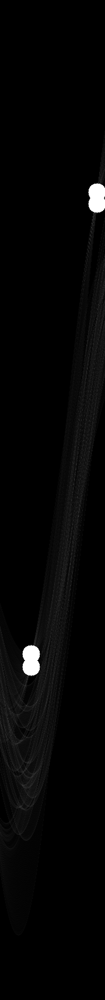
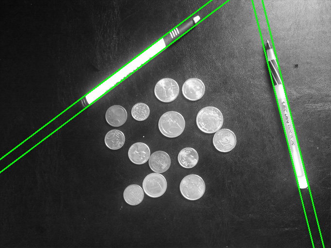

###5. Hough Transform for Circles
a0) Input image - a1) Smoothed image - a2) Edge image  

  
a3) Detected circles for r=20px - b1) Detected circles for r in [20,50] px  

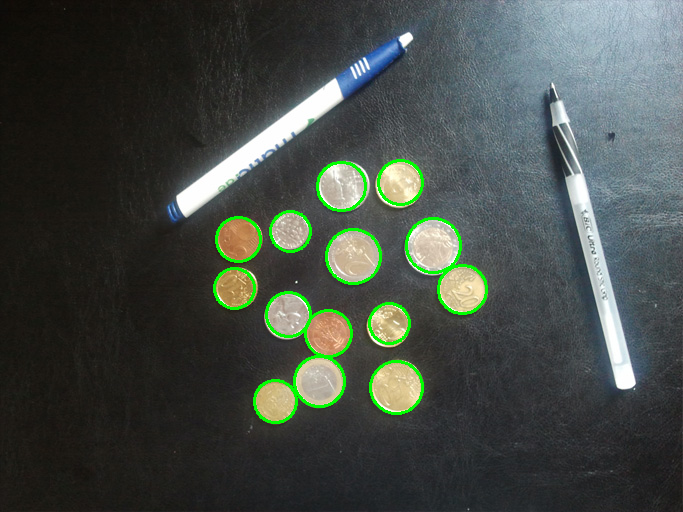  

###6. Hough Transform for Lines on Cluttered Image
a0) Input image - a1) Highlighted detected lines - c1) Detected Lines under constraints  
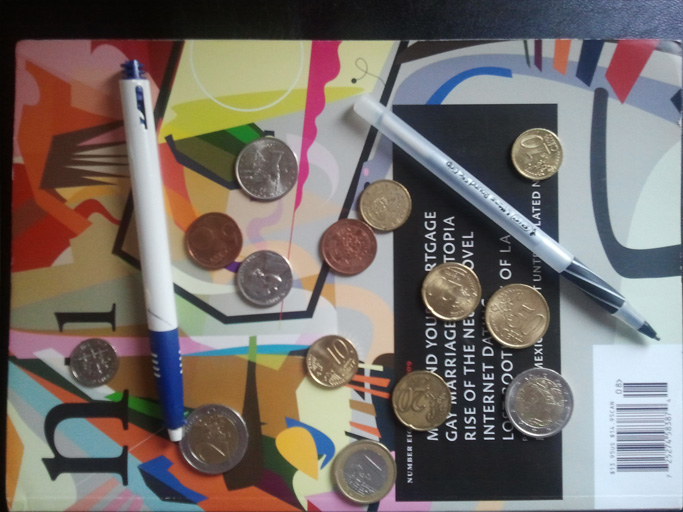
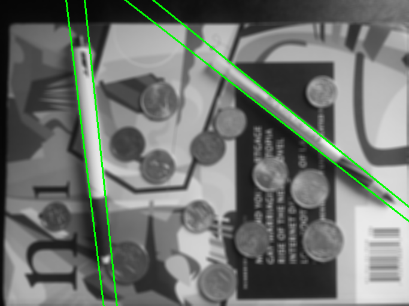
  
c) The boundaries of the pens were extracted by selecting the lines that complied
with two constraints. In particular, the selection algorithm only kept the lines
that had at least one approximate parallel line (delta\_theta < delta\_theta\_max)
and in a distance smaller than rho\_max.

###7. Hough Transform for Circles on Cluttered Image
a0) Input image - a1) Highlighted circles  

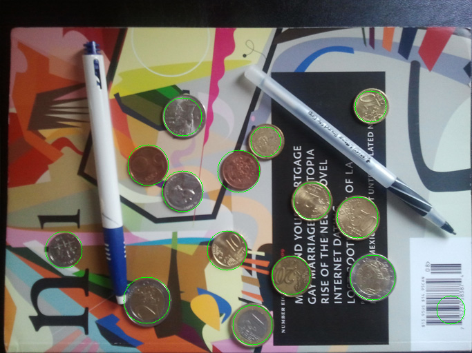

###8. Hough Transform for Lines and Circles on Distorted Cluttered Image
a0) Input image - a1) Highlighted lines and circles  
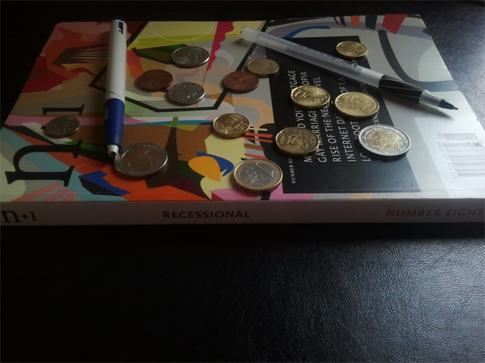
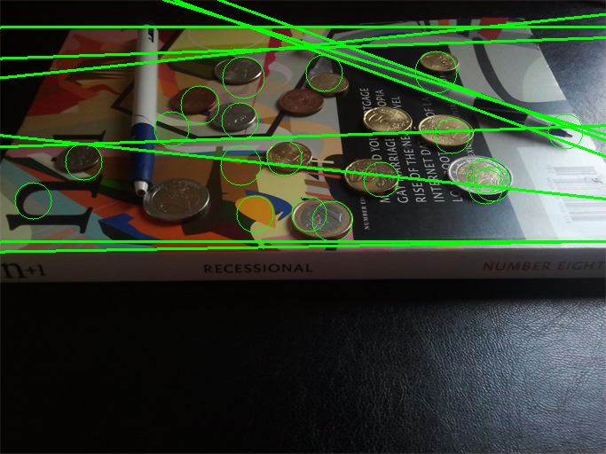  
b) The circles in the distorted input image are actually ellipses and thus cannot
be accurately detected by a Hough transform for circles. This could probably be
solved by using a Hough transform for ellipses or by applying a homography transform
to partially fix the distortion and turn the ellipses back to circles.

