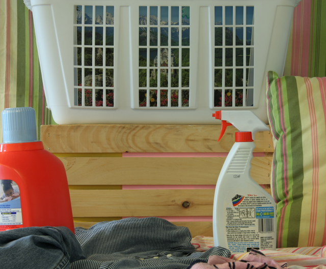
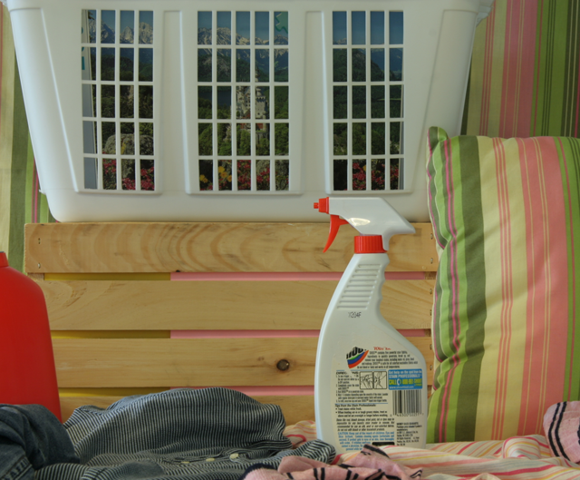

# Problem Set 0: Images as Functions

###1. Stereo correspondence using SSD template matching
Input stereo image pair (L,R):  

  
a) Disparity maps of the stereo image pair using SSD template matching  

###2. Stereo correspondence using SSD template matching on real images
Input stereo image pair:  

  
Disparity maps ground truth:  

  
Produced disparity maps:  

###3. Demonstration of perturbations induced by gaussian noise when using SSD template matching
Input stereo image pair with noisy left image and resulting disparity maps:  

  
Stereo image pair with increased contrast(10%) in left image and resulting disparity maps:  

###4. Stereo correspondence using Normalized Correlation
Input stereo image pair:  

a) Disparity maps of the stereo image pair using normalized correlation template matching:  

  
b) Disparity maps of noisy stereo image pairs:  

  
c) Disparity maps of contrast-bossted stereo image pair:  

###5. Stereo correspondence after pre/post-processing(smoothing, sharpening etc.)
Input stereo image pair:  

  
Preprocessed input stereo image pair:  

  
Disparity maps:  

  
Postprocessed disparity maps (final result):  

  

### 6. Stereo correspondence using opencv:
Input stereo image pair:  

  
Disparity maps:  

  

