# Problem Set 2: Window-based Stereo Matching

###1. Stereo correspondence using SSD template matching
Input stereo image pair (L,R):  
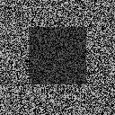
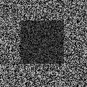  
Disparity maps of the stereo image pair using SSD template matching:  
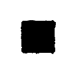

###2. Stereo correspondence using SSD template matching on real images
Input stereo image pair:  
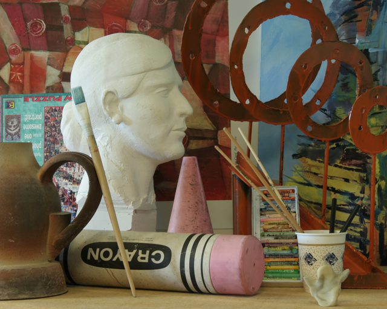
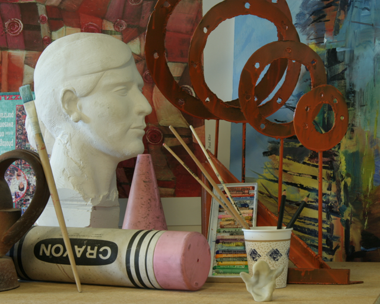  
Disparity maps ground truth:  
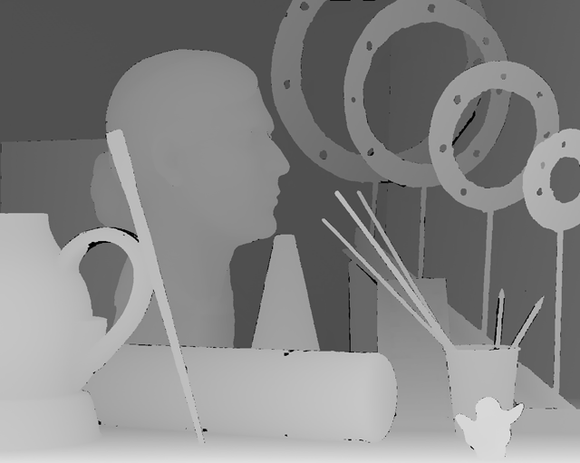
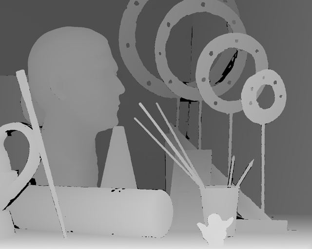  
Produced disparity maps:  
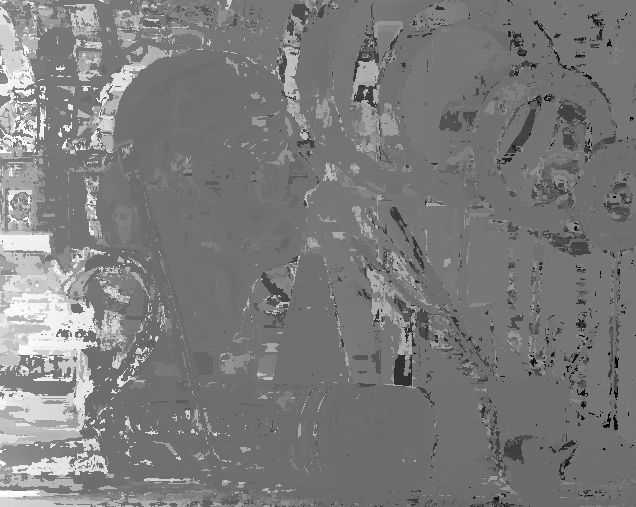
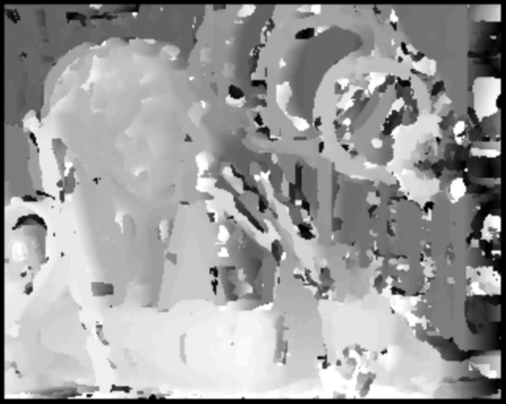

###3. Perturbations in SSD template matching due to noise
Input stereo image pair with noisy left image and resulting disparity maps:  
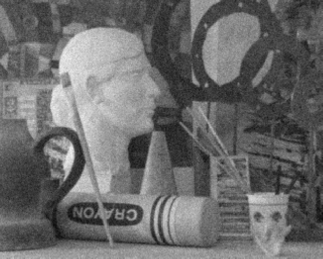
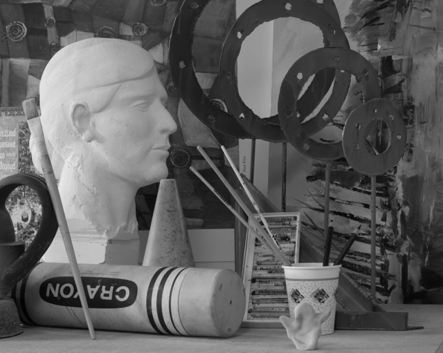  
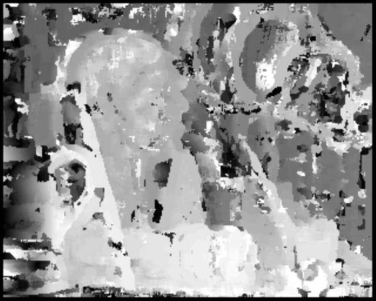
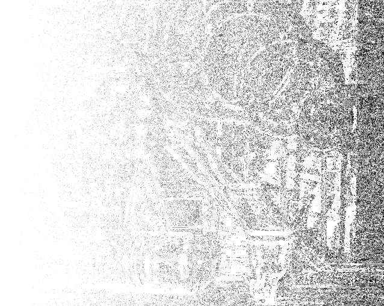  
Stereo image pair with increased contrast(10%) in left image and resulting disparity maps:  

  

###4. Stereo correspondence using Normalized Correlation
Input stereo image pair in grayscale:  
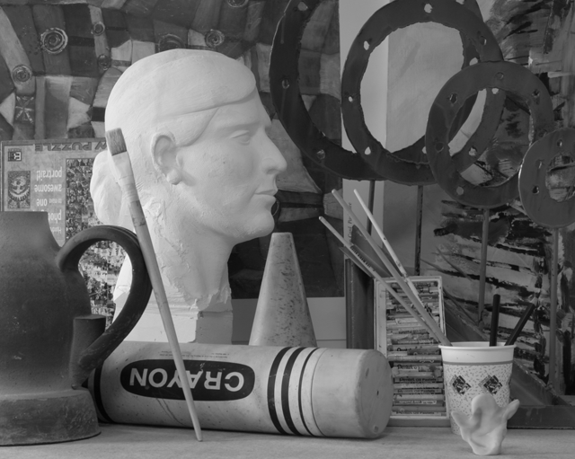

Disparity maps of the stereo image pair using normalized correlation template matching:  
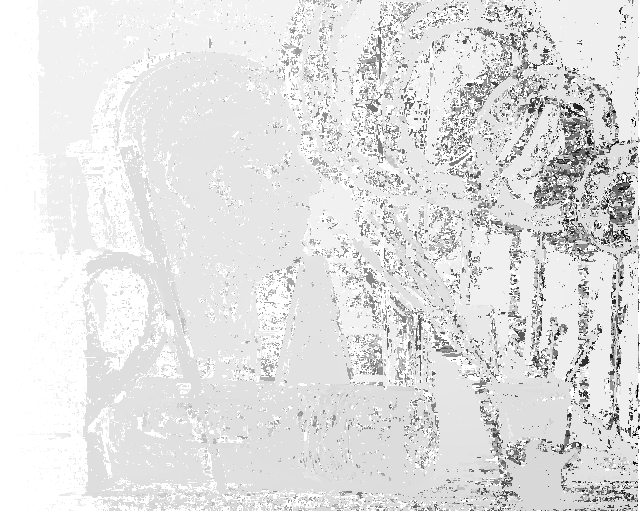
  
Disparity maps of noisy stereo image pairs using normalized correlation template matching:  
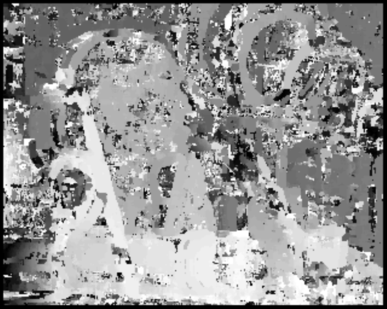
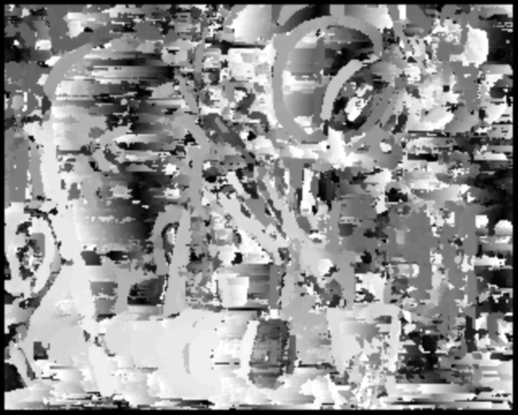  
Disparity maps of contrast-bossted stereo image pair using normalized correlation template matching:  
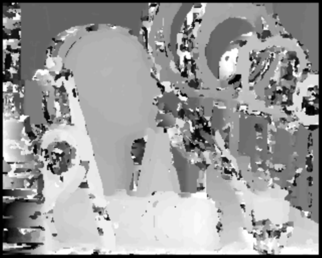
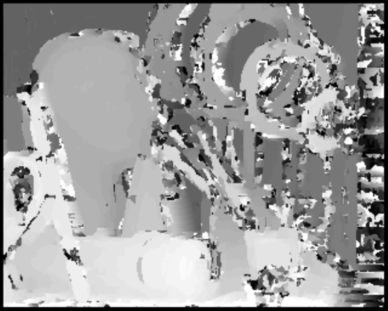

###5. Stereo correspondence after pre/post-processing
Input stereo image pair:  
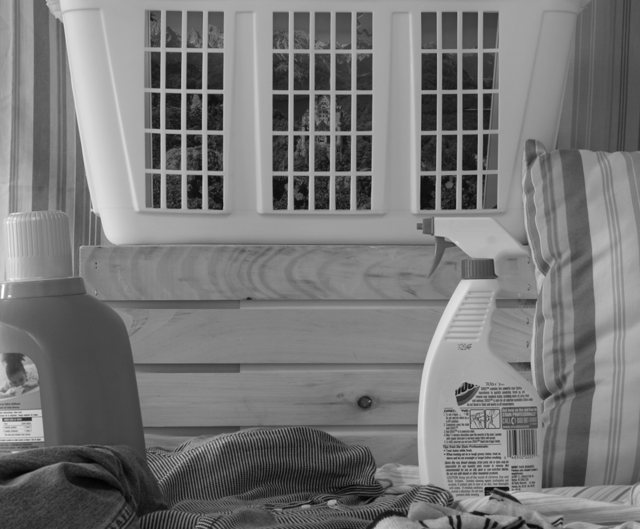
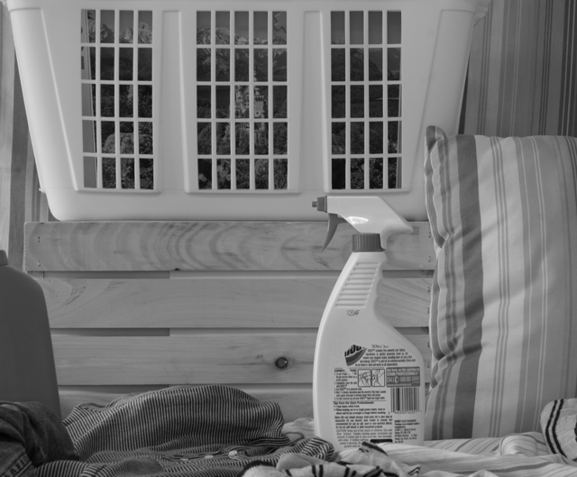  
Disparity maps:  
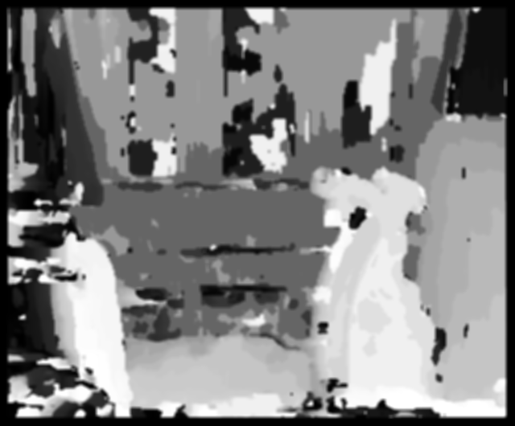
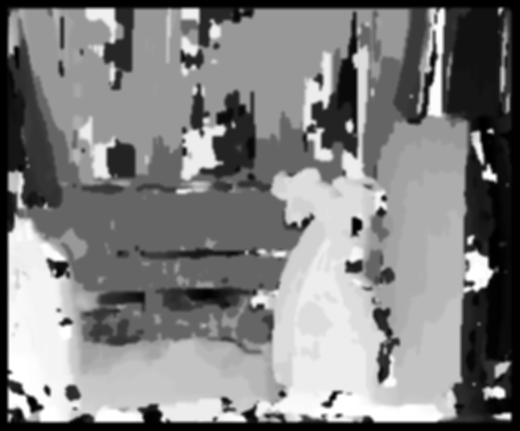  
