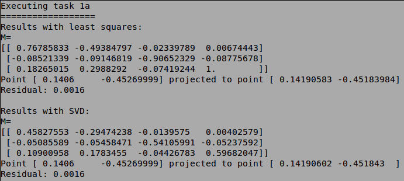
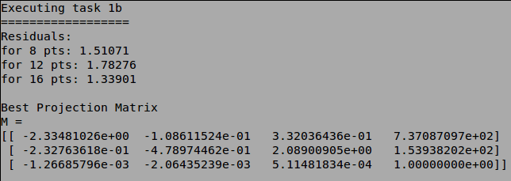
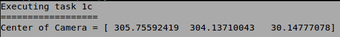
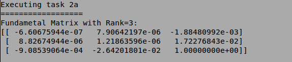
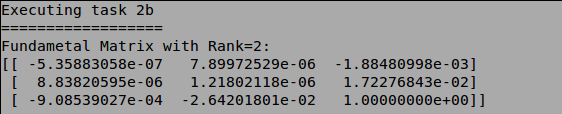
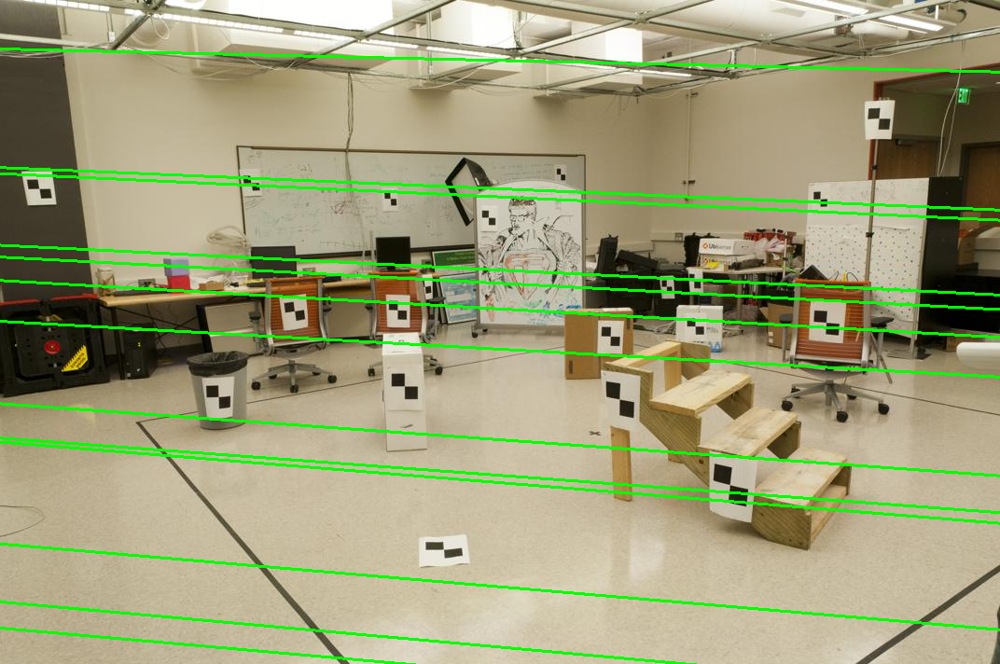
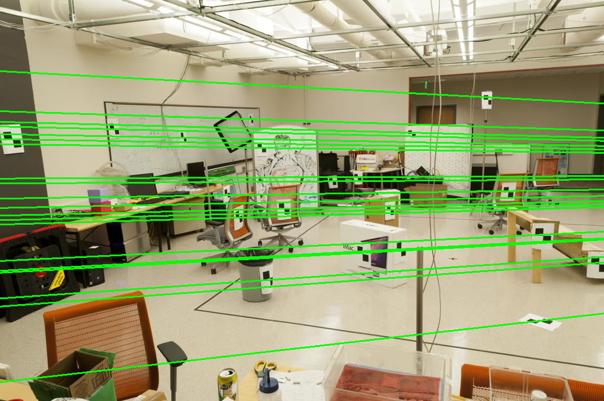
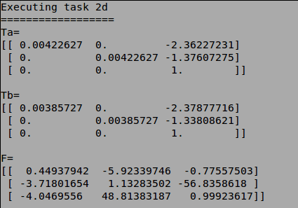
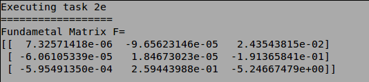
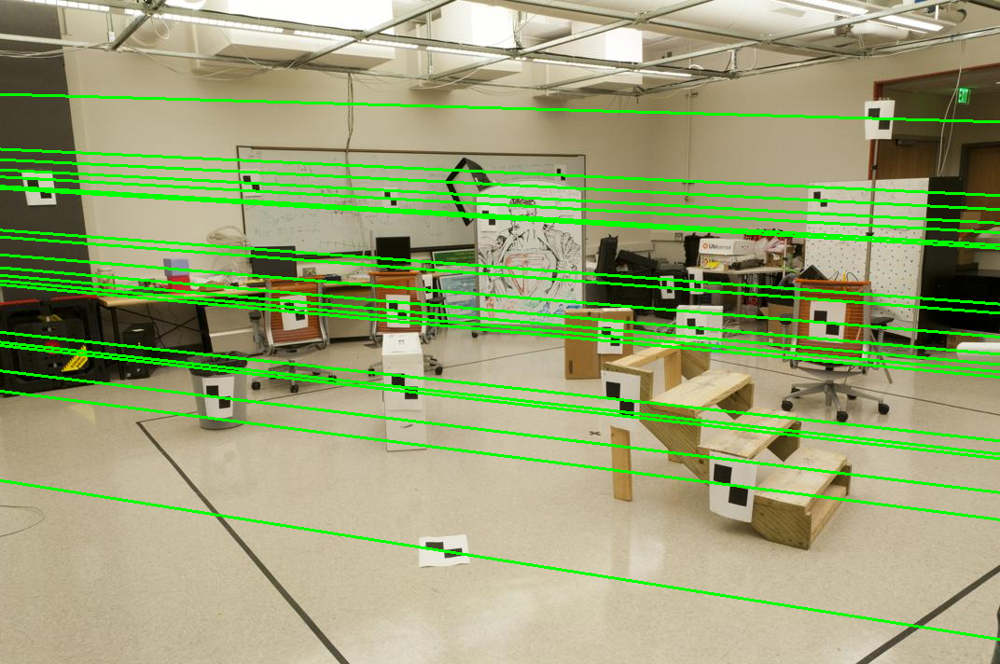

# Problem Set 3: Geometry

###1. Calibration
a) Projection matrix via the least squares method or SVD on 20 2d-3d point pairs:  
  
b) Projection matrix estimation using 8, 12 and 16 point pairs:  
  
c) Camera position on a 3D world coordinate system:  

###2. Fundamental Matrix Estimation
a) Fundamental Matrix Estimation using the least squares method on 20 2d point pair:  
  
b) Fundamental Matrix Rank Reduction from 3 to 2:  
  
c) Epipolar lines estimation using F and the 2D point pairs in each image  

  
d) F Improvement using the normalization matrices Ta and Tb:  
  
e) Improved Fundamental Matrix and Epipolar Lines using normalization:  
  

  

