# Problem Set 4: Harris Corners, SIFT & RANSAC

### 1. Harris Corners
##### a) X and Y image gradients 
Input image simA.jpg and corresponding gradients in X and Y axes:  
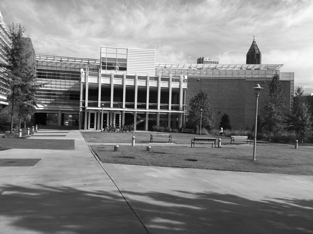
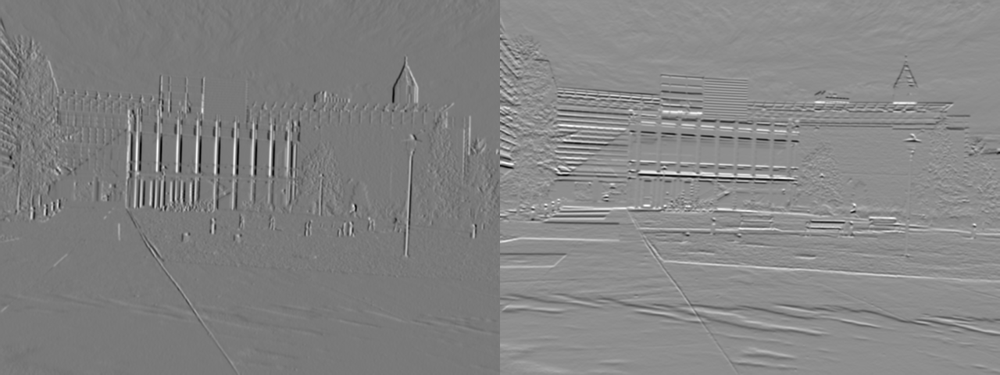  
Input image transA.jpg and corresponding gradients in X and Y axes:  
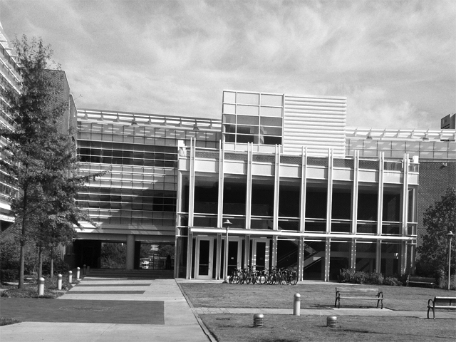
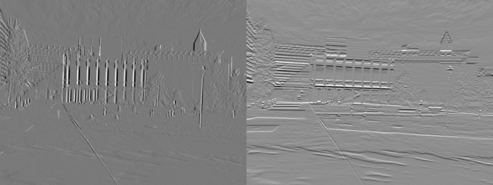  
##### b) Harris Values
Input images simA, simB, transA, transB:  

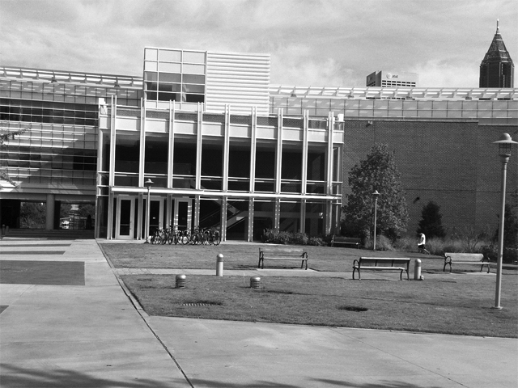
Corresponding Harris Value images:  
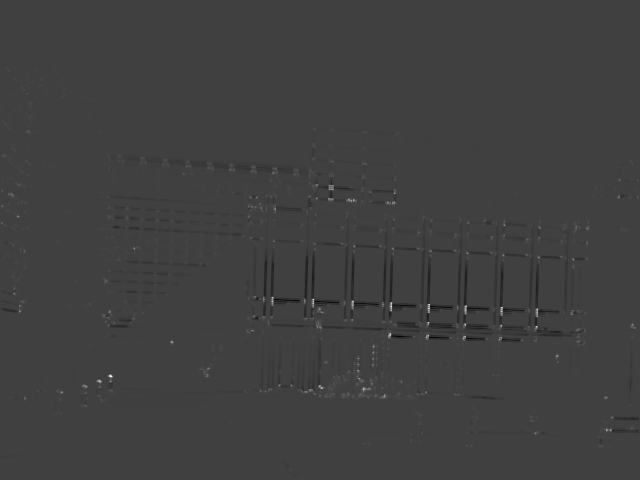
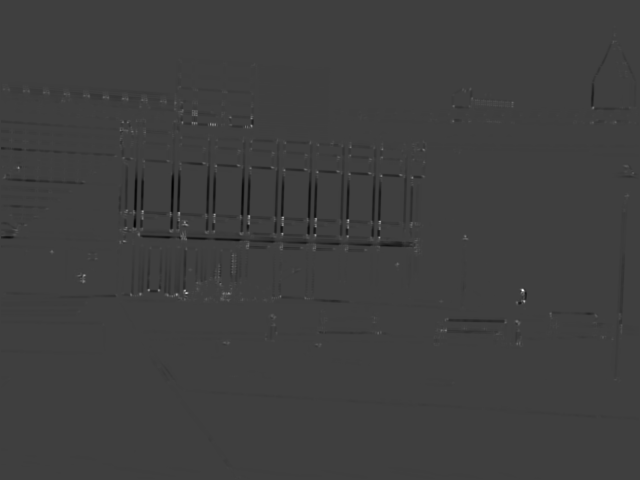
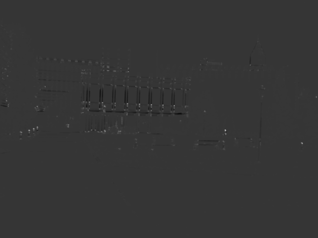
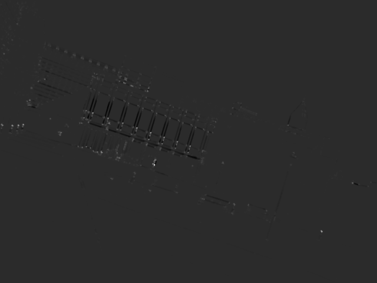
##### c) Harris Corners
Images with Harris Corners marked:  
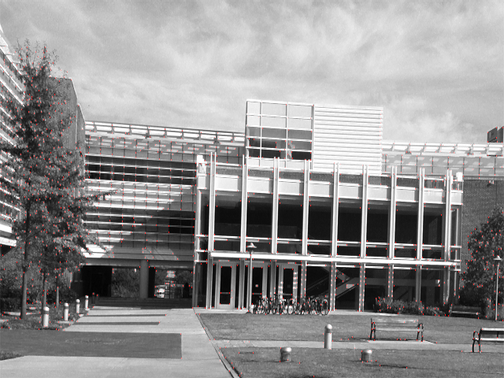
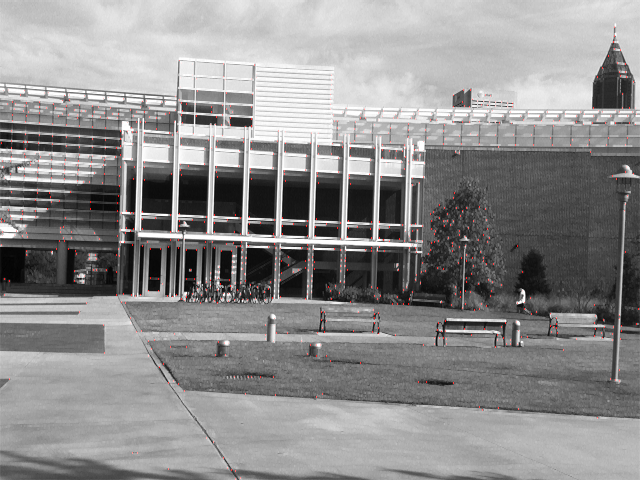
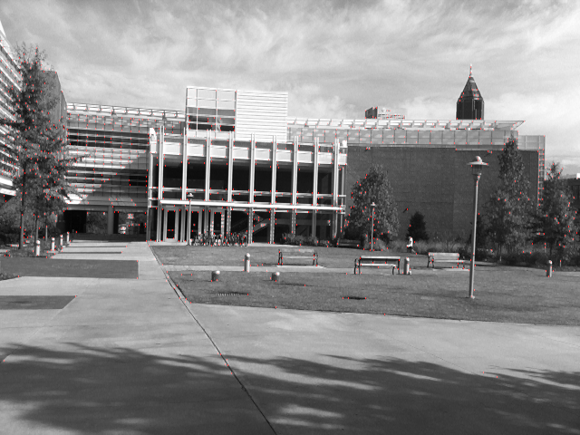
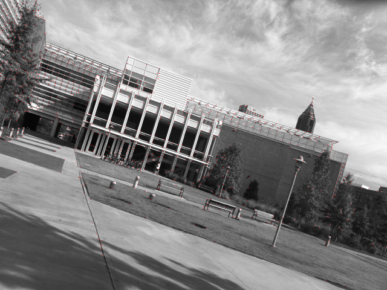

### 2. SIFT Features
##### a) Interest Points on trans and sim image pairs
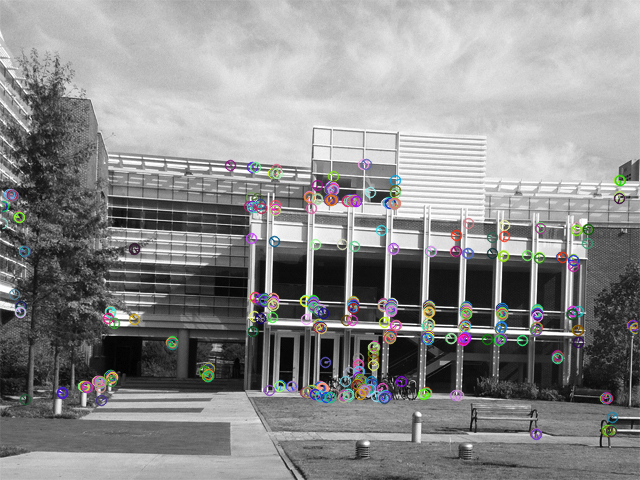
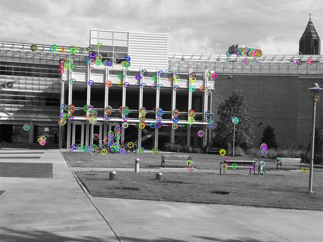
##### b) Putative pair images for the trans and sim image pairs
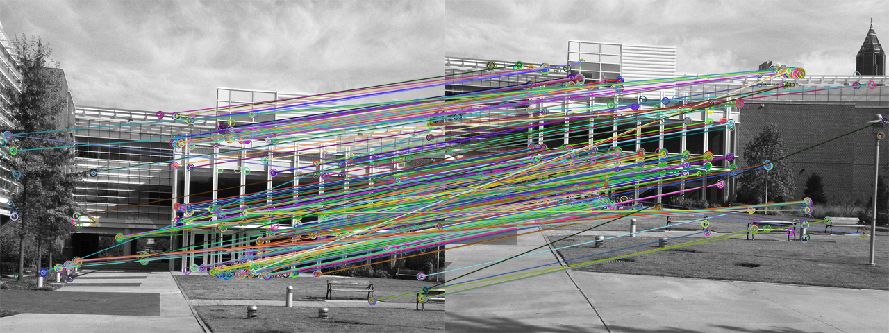
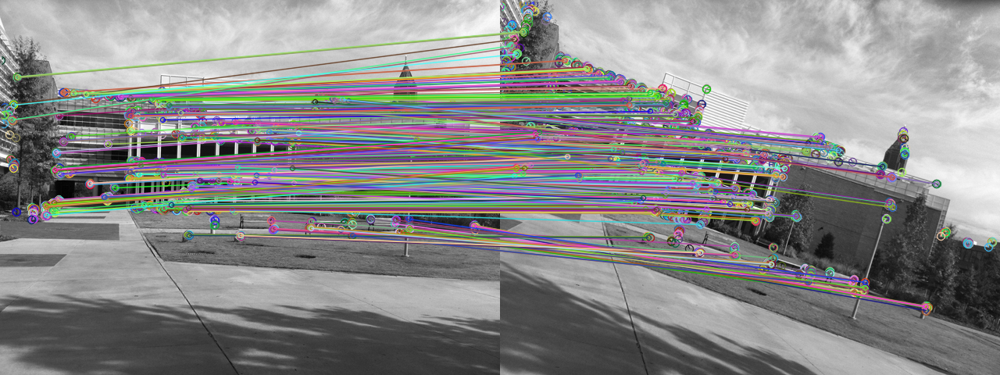

###  3. RANSAC
##### a) Largest consensus set drawn on the trans image pair
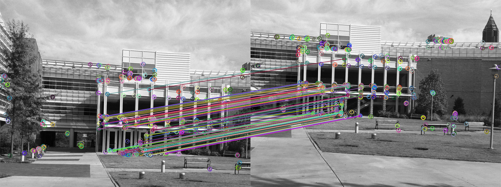
##### b) Largest consensus set drawn on the sim image pair using similarity transform comparison
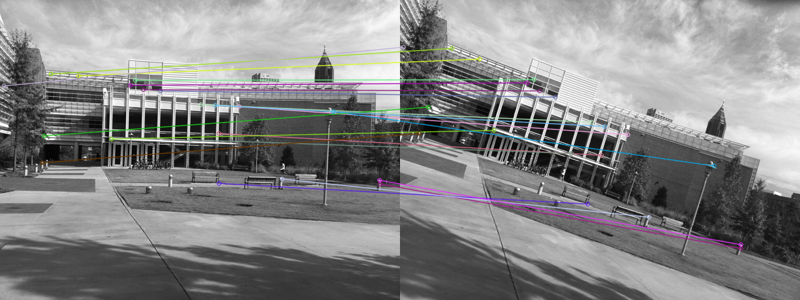
##### c) Largest consensus set drawn on the sim image pair using Affine transform comparison
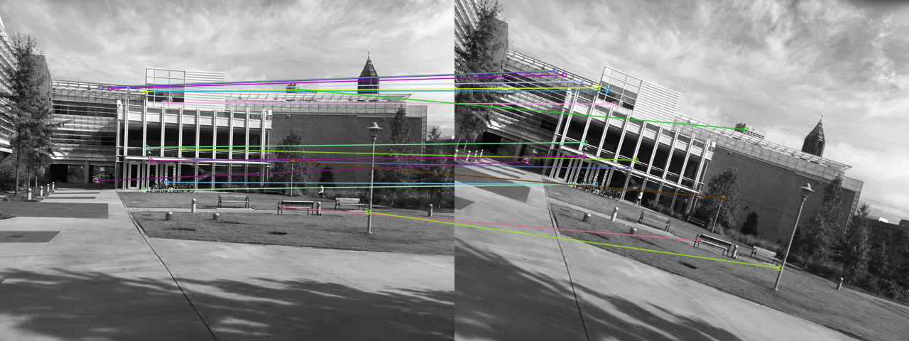
##### d) Backwards warping and blending of the 2nd image to the 1st based on the similarity consensus set

##### e) Backwards warping and blending of the 2nd image to the 1st based on the Affine consensus set

