# Problem Set 5: Optic Flow

### 1. Lucas Kanade Optic Flow

##### a) Input images and X,Y displacement images between the first and the others
 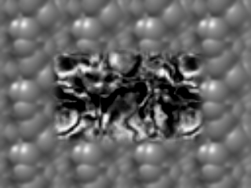 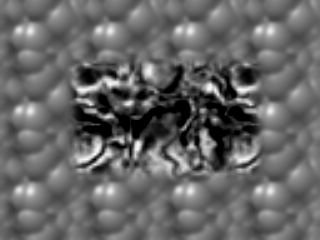  
 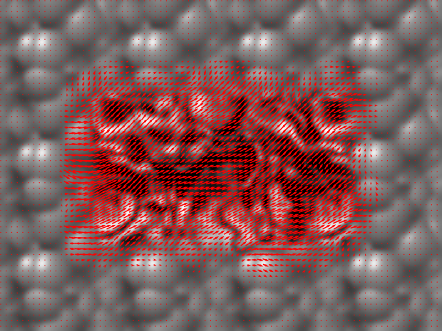

##### b) Input images and X,Y displacement images between the first and the others
 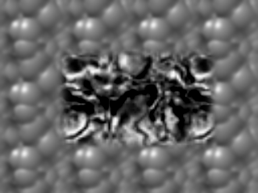 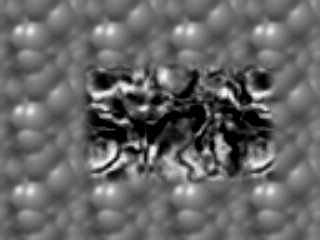 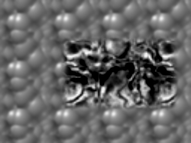  
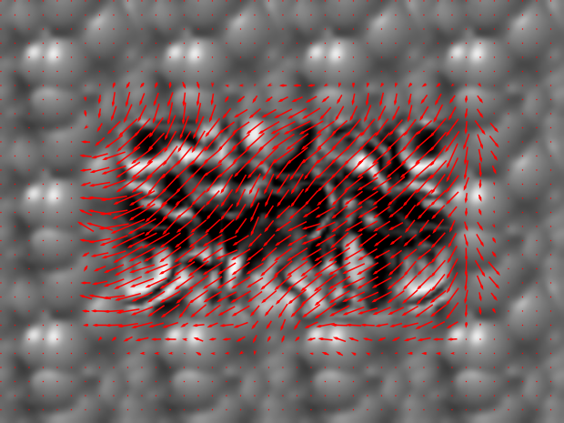 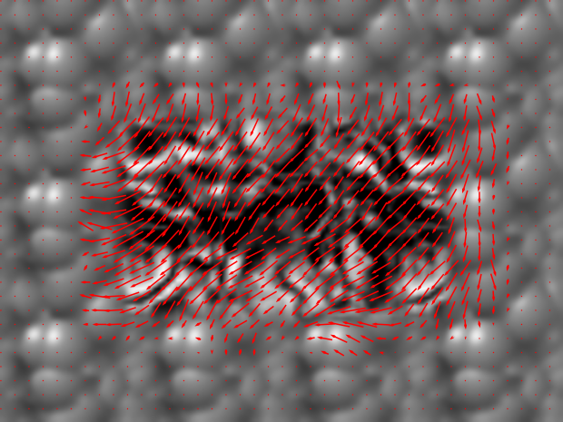 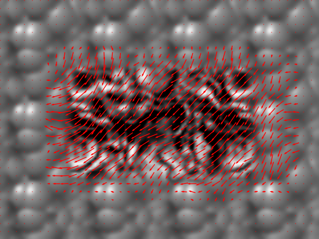

### 2. Guassian and Laplacian Pyramids

##### a) Gaussian Pyramid of the first frame of DataSeq1

##### b) Laplacian Pyramid of the first frame of DataSeq1
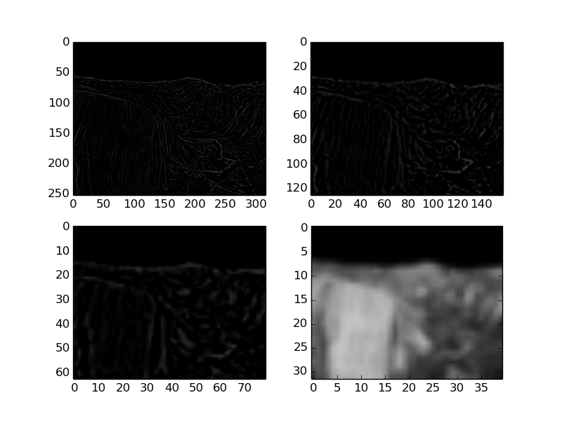

### 3. Warping by Flow

##### Single Level Lucas-Kanade application on DataSeq1 and Backwarping
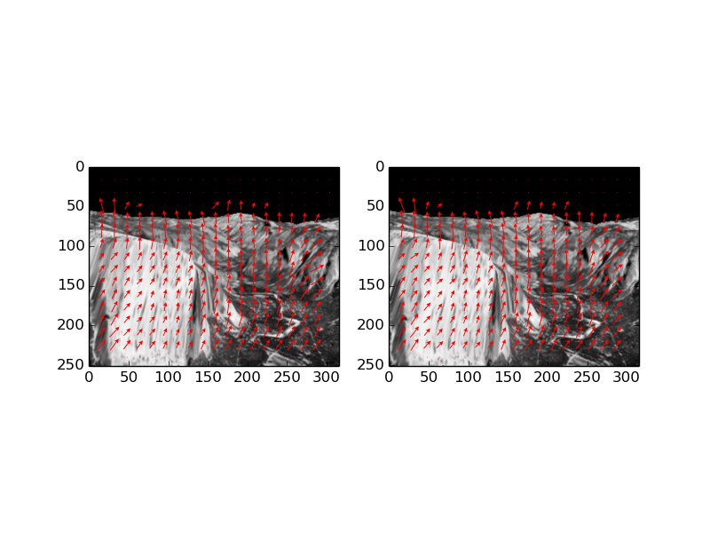 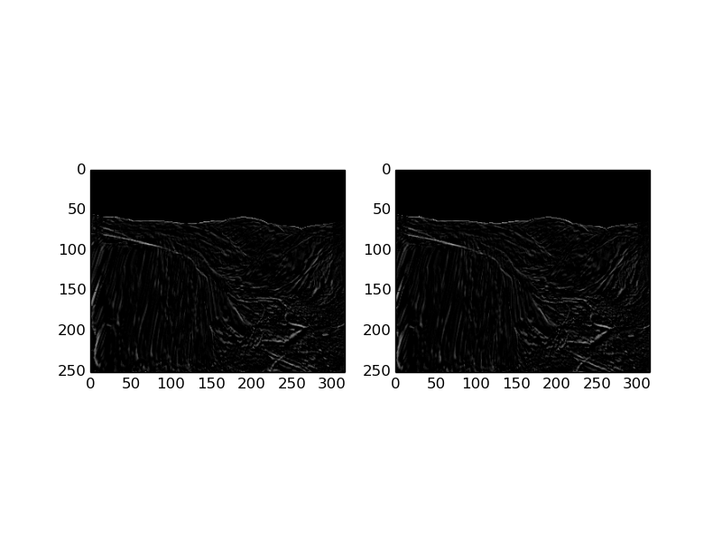

##### Single Level Lucas-Kanade application on DataSeq2 and Backwarping
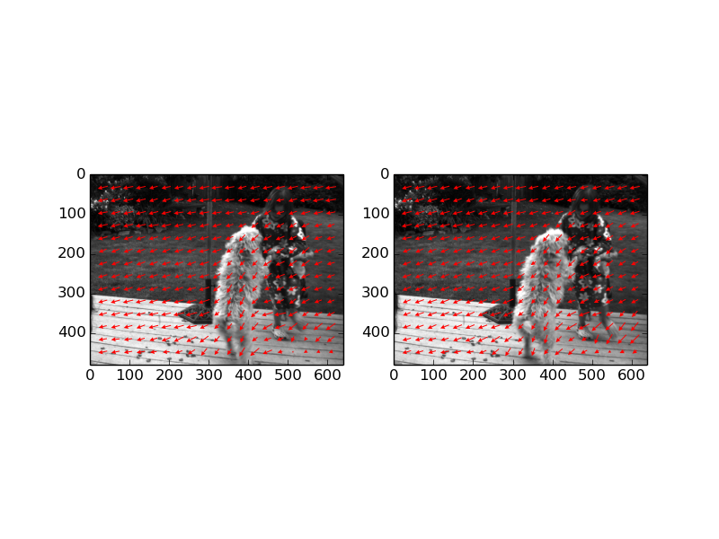 
