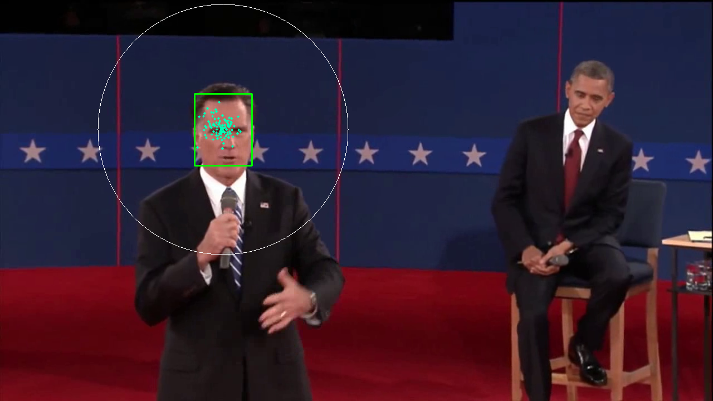
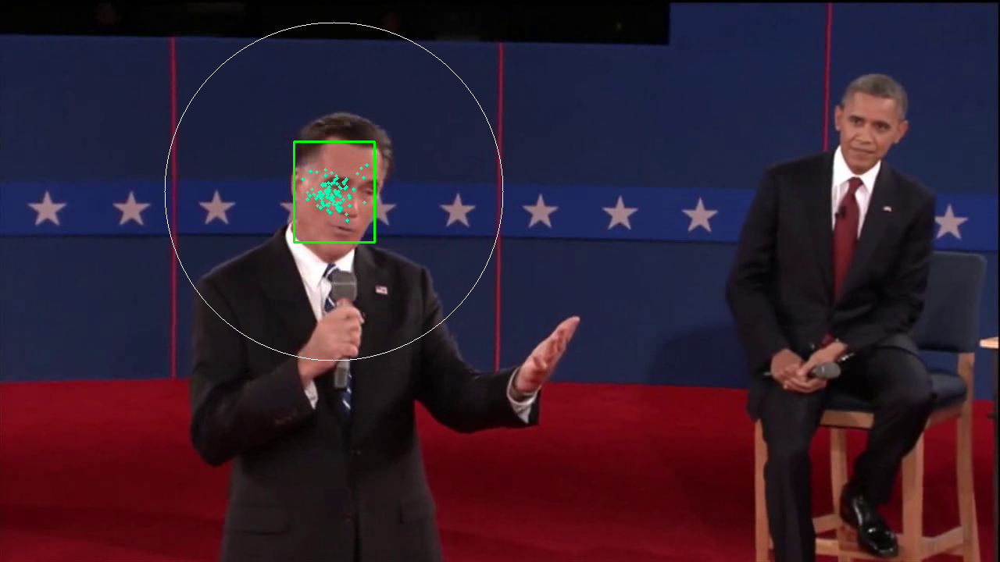
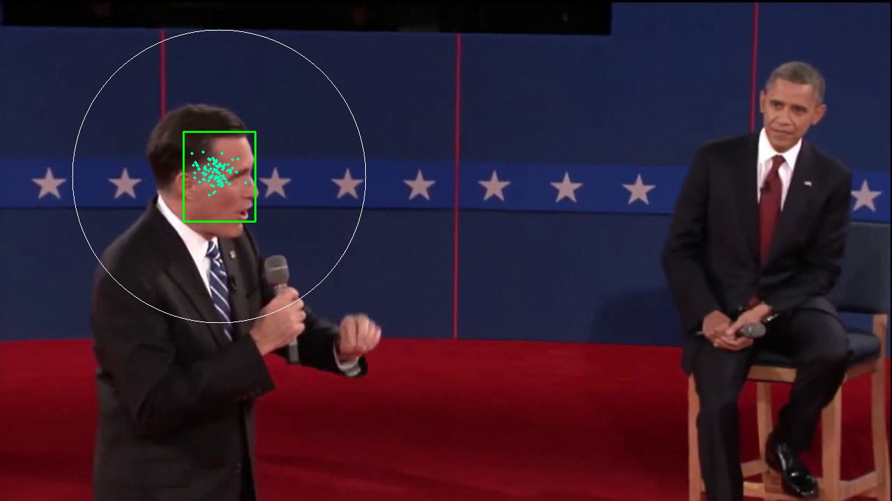
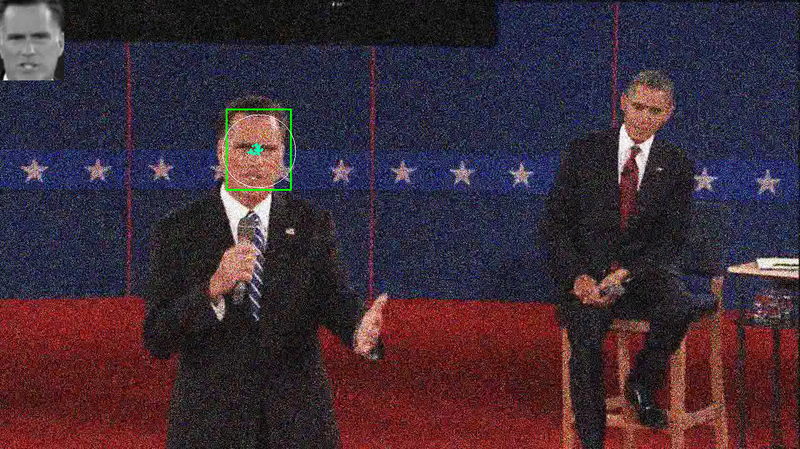
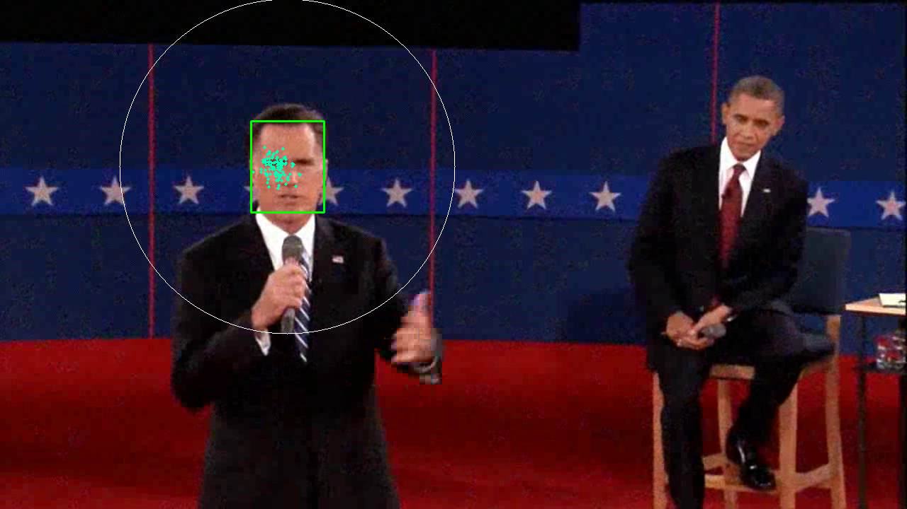
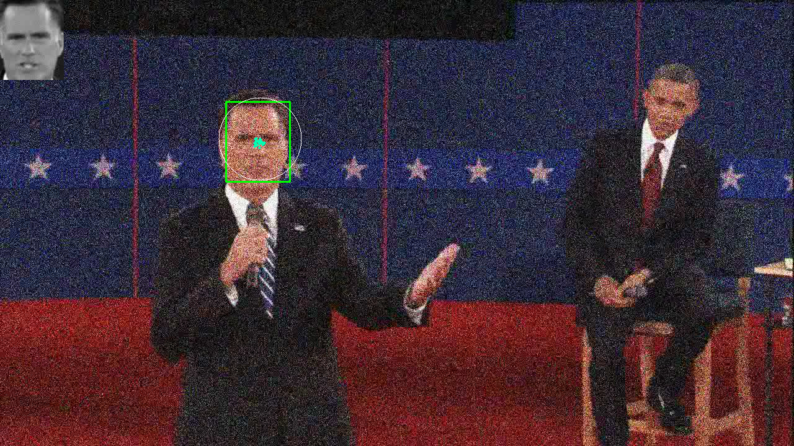
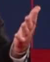
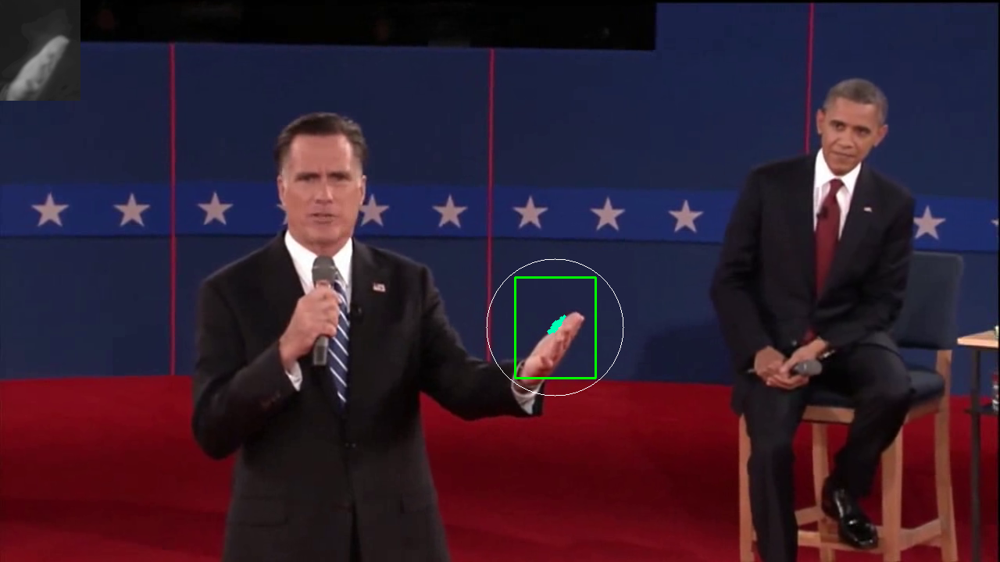
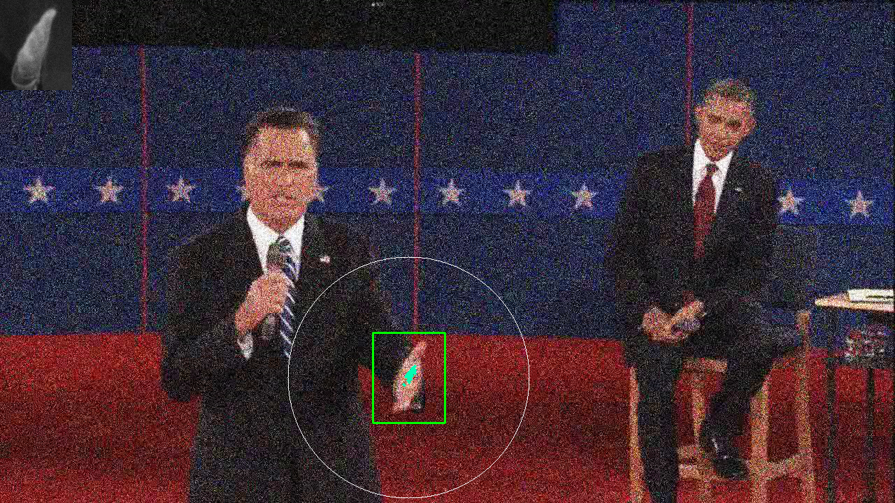
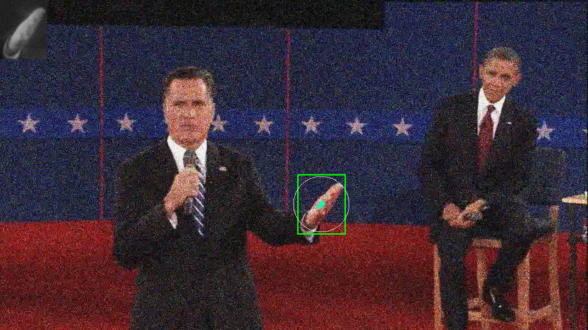

# Problem Set 6: Particle Tracking

### 1. Particle Filter Tracking
##### a) Tracking Romney's face in pres\_debate.avi (displayed frames: 28, 84, 144)
   
##### e) Tracking Romney's face in noisy\_debate.avi (displayed frames: 14, 32, 46)
   

### 2. Appearance Model Update
##### a) Tracking Romney's left hand (displayed frames: 28, 84, 144)
   
##### a) Tracking Romney's left hand on noisy video (displayed frames: 15,50,140)
   
