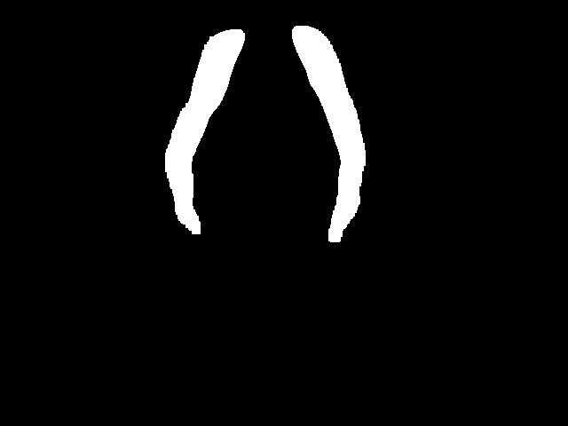
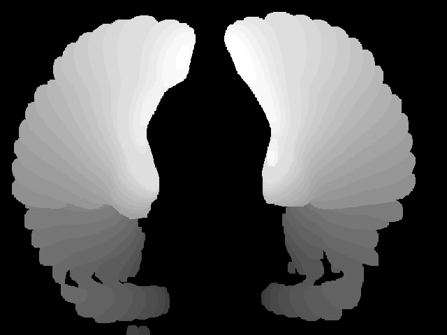
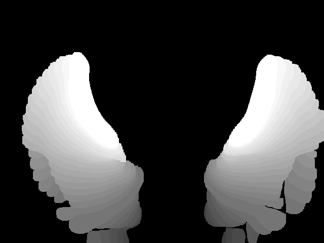
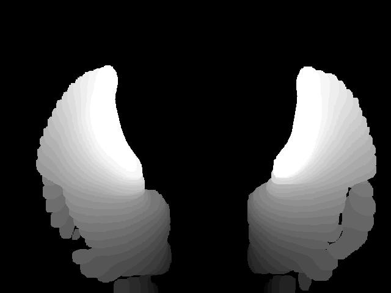
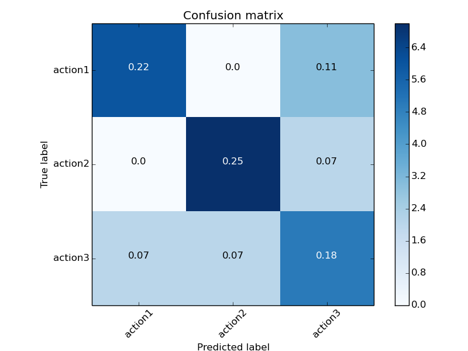
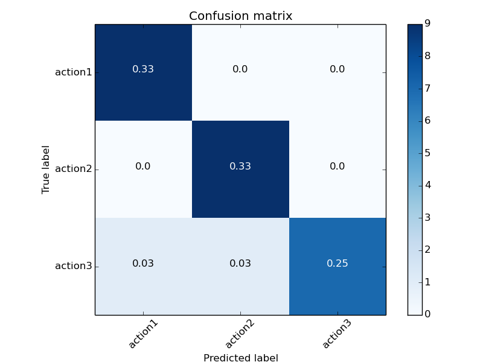
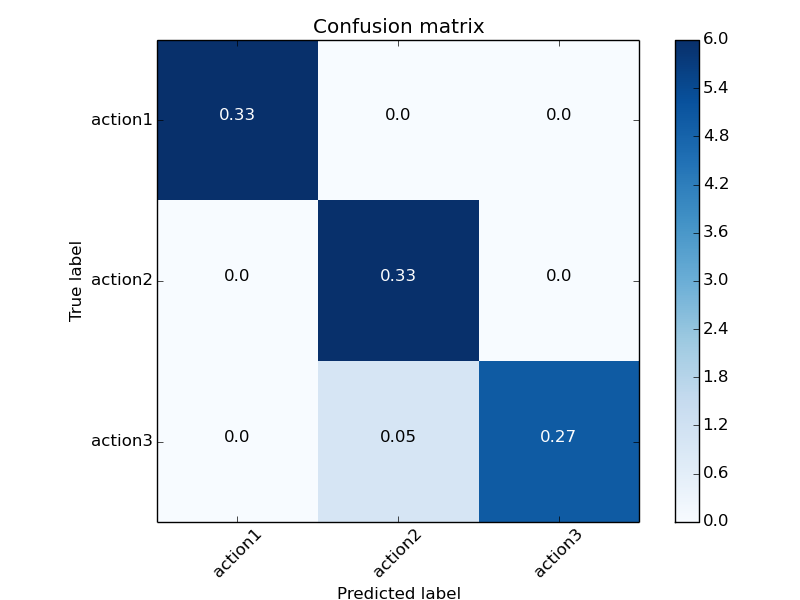
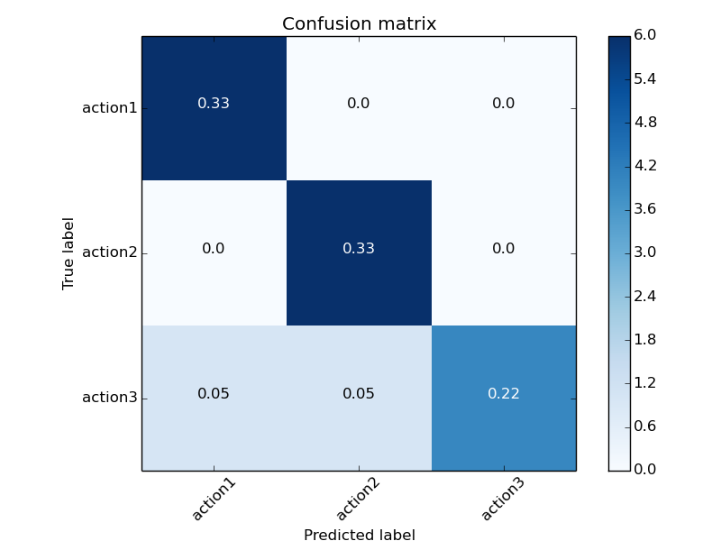
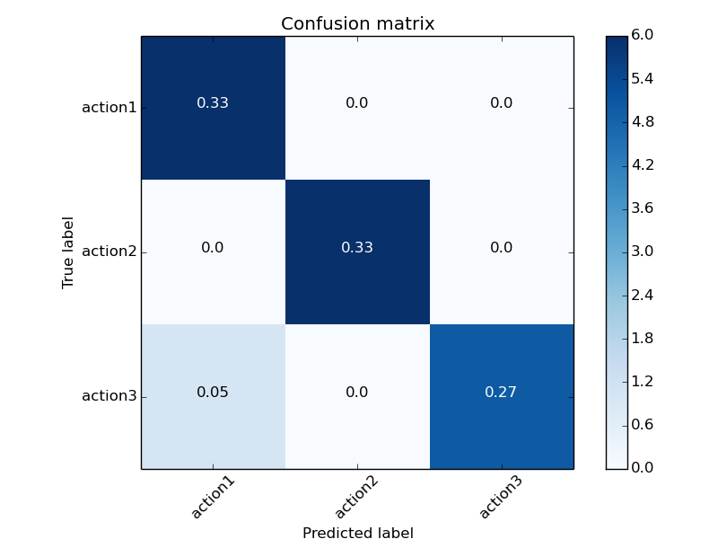

# Problem Set 7: Motion History Images

### 1. Frame-Differenced MHI
##### a) Binary Sequence of PS7A1P1T1.avi for frames at t=10,20,30
  
##### b) Corresponding MHI for each action
  

### 2. Recognition using MHIs
##### a) Confusion Matrix for 1-NN classification using Leave-One-Out cross validation for mu and eta moment matrices
 
##### b) Confusion Matrices for 1-NN classification using cross validation, by removing one person at a time and the corresponding average
   

